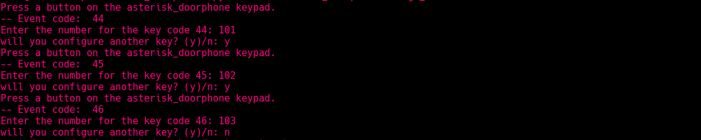
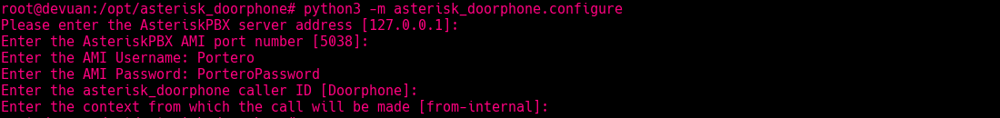
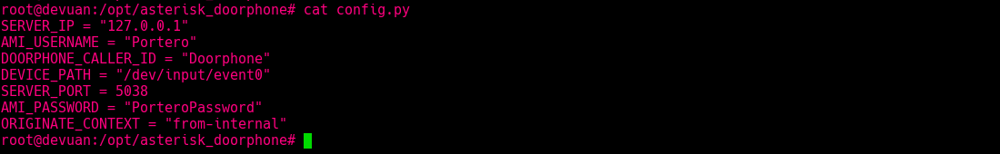

# asterisk_doorphone
A Python package for an Asterisk based building doorphone.


## Installation

Use the package manager [pip](https://pip.pypa.io/en/stable/) to install asterisk_doorphone.

```bash
pip3 install asterisk_doorphone
```

## Usage
### usb keyboard module
The usb_keyboard module permits to use a PC USB keyboard as keyboard of a building doorphone. 
It connects to Asterisk via AMI, check the status of the doorphone and place the call using 'Originate' command 
connecting the doorphone with the apartment phone.
###
#### Preparing Asterisk config

Create a SIP trunk:
```Asterisk
[Portero]
host=dynamic
username=Portero
secret=PASSWORD
type=peer
qualify=yes
context=from-trunk
busylevel=1
callcounter=yes
```
`busylevel=1` and `callcounter=yes` permit to check the extension status using asterisk hints.

Add the hint for the doorphone to check the status 
in `extensions_custom.conf` add:
```asterisk
[from-internal-custom]
exten => 800,hint,SIP/Portero
```

###
Create an outbound route.   


This will create an outbound route like:
```asterisk
exten => 800,n,Macro(dialout-trunk,1,${EXTEN},,off)
```  

###
Add a user for the asterisk_doorphone in Asterisk AMI with the permits 'call', 'reporting' and 'originate'.   
```asterisk
[Portero]
secret = PorteroPassword
deny=0.0.0.0/0.0.0.0
permit=127.0.0.1/255.255.255.0
read = call,reporting,originate
write = call,reporting,originate
writetimeout = 100
```

Or in freePBX:  


#
#### Keyboard config

We need to create a file containing the apartments numbers and a file with the config to use with Asterisk.  
`asterisk_doorphone` has a module for this.  
The `assign_buttons` module creates a file in the current directory containing a Python dictionary of the codes 
for every used key in the USB keyboard and an apartment number associated to that code.

```bash
# python3 -m asterisk_doorphone.assign_buttons
```

Select a keyboard to use as doorphone keyboard


Press a key in the doorphone keyboard and assign a number for that key.


And the output to the file will be something like:
 


###
The `configure` module help us to create a file in the current directory containing the constants to use 
with Asterisk and the `path` to the keyboard assigned for the doorphone.

```bash
# python3 -m asterisk_doorphone.configure
```



and the output is something like:
 


To start the service create a file containing the following:
```python
from asterisk_doorphone.usb_keyboard import UsbKeyboard

import apartments
import config


def main():
    keyboard = UsbKeyboard(apartments, config)
    keyboard.start()


if __name__ == "__main__":
    import sys
    sys.exit(main())
```
and execute with python3
```bash
python3 main.py
```

If you prefer in the background:
```bash
nohup python3 main.py  > /var/log/asterisk_doorphone.log 2>&1 &
```

## Contributing
Pull requests are welcome. For major changes, please open an issue first to discuss what you would like to change.

## License
[MIT](https://choosealicense.com/licenses/mit/)
